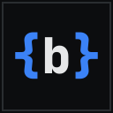

<p align="center"></p>

<h1 align="center">belz-extension</h1>

Productivity tools for engineers working in Service Designer's **Automation Designer (AD)** and **Page Designer (PD)**: a full-screen code editor for any text box, a JSON editor for method inputs, handy shortcuts, and two DevTools panels. It runs on Chrome, Edge, Brave, Firefox and Zen, works only on the sites you add yourself, and collects nothing.

## Install

**Chrome, Edge, Brave:**

> [!NOTE]
> **Not on the Chrome Web Store yet.** It is waiting for Google's review, so the store link below doesn't work yet. Until then, use **Load a release by hand** below.

Install it from the [Chrome Web Store](https://chromewebstore.google.com/detail/heenggkonmlbicnokmkbeoodfmfjlgao) and click **Add to Chrome** (in Edge, allow extensions from other stores when asked). The store keeps it up to date.

**Load a release by hand** (works now; it doesn't update itself, so switch to the store version once it's live):

1. Download `belz-extension-<version>-chrome.zip` from the [latest release](https://github.com/ParthKapoor-dev/belz-extension/releases/latest) and unzip it.
2. Open `chrome://extensions` (or `edge://extensions`, `brave://extensions`) and turn on **Developer mode**.
3. Click **Load unpacked** and choose the unzipped folder.

**Firefox, Zen** (Firefox 128 or newer; Zen is built on it):

1. Download `belz-extension-<version>-firefox.xpi` from the [latest release](https://github.com/ParthKapoor-dev/belz-extension/releases/latest).
2. Open it in Firefox (or drag it onto a Firefox window) and confirm. It is signed by Mozilla and updates itself.

## Setup

The extension does nothing until you tell it which sites to work on.

1. Open the extension's options page:
   - Chrome, Edge, Brave: `chrome://extensions` → **belz DevTools** → **Details** → **Extension options**
   - Firefox, Zen: `about:addons` → **belz DevTools** → **Preferences**
2. Under **Allowed sites**, type your instance's hostname (like `your-instance.example.com`) and click **Add**. Only https sites can be added.
3. Approve the browser's permission prompt.
4. Reload any tabs you already had open on that site.

Repeat for each environment you use. **Revoke** removes a site and its permission. If your Automation Designer lives on a different host, see [designer host](docs/usage.md#setup).

## Features

- **IDE:** hover any text box and click **⤢** to edit it full-screen, with syntax highlighting, search, SQL/JSON formatting, `#{variable}` autocomplete and checks (AD), and an optional Vim mode.
- **JSON input editor:** edit all of a method's inputs as one JSON document and sync them back, each with the right type.
- **Run Test and link shortcuts:** run the test from anywhere, or copy a link to the method.
- **Copy buttons** on text boxes and method outputs.
- **Readable tab titles:** `AD: <method>` and `PD: <page>`.
- **AD Network panel** (DevTools): every AD method call the page makes, by name, with copy as cURL and **Open in draft** with its inputs filled in.
- **PD Inspector panel** (DevTools): a published page's component tree, and which component rendered what you point at.
- **Settings modal:** the **⚙** next to the page title turns each feature on or off.

Every feature in detail: [docs/usage.md](docs/usage.md).

## Keyboard shortcuts

| Shortcut | Does |
|---|---|
| `Ctrl+Shift+Enter` | Run Test (AD) |
| `Shift+J` | Open the JSON input editor (AD) |
| `Shift+L` | Copy a link to the method (AD) |
| `Esc` `Esc` | Leave the current field, so your edit registers |
| `Alt+Shift+S` or `Alt+,` | Open the Settings modal |
| `Ctrl+S` | Save and close the IDE |
| `Shift+Alt+F` | Format SQL or JSON in the IDE |
| `Ctrl+Shift+A` / `Ctrl+Shift+P` | Jump to AD Network / refresh PD Inspector |

On a Mac, the IDE's keys are `Command+S` and `Shift+Option+F`, and the panel keys `Command+Shift+A` / `Command+Shift+P`. The [full table](docs/usage.md#keyboard-shortcuts) also explains how to change the browser-level shortcuts.

## Updating and your data

Updates keep your sites, permissions and settings. Removing the extension deletes all of them. A build you loaded by hand and the store version are separate installs, so add your sites again after switching.

## Troubleshooting

- **Nothing appears on the page:** check that the site is in **Allowed sites** and shows **Revoke** (click **Grant** if it doesn't), then reload the tab.
- **The DevTools tabs are missing:** they appear only on allowed https sites. Close and reopen DevTools after adding a site.
- **AD Network shows IDs instead of names:** sign in to the site; the panel retries by itself.
- **Something stopped working after an AD/PD update:** turn on **Debug Logging** in Settings, reload, check the console for `[belz:…]` messages, and [open an issue](https://github.com/ParthKapoor-dev/belz-extension/issues).

More in [docs/usage.md](docs/usage.md#troubleshooting).

## Privacy

The extension talks only to the site you are on, with the sign-in you already have there; it has no server, no analytics and no telemetry. It asks for storage, scripting, a DevTools page, keyboard commands and access to each https site you add, and [PRIVACY.md](PRIVACY.md) explains each one.

## Development

```bash
bun install && bun run build    # then load build/chrome or build/firefox
```

Requirements, the edit loop and tests: [docs/development.md](docs/development.md). How the code fits together: [AGENTS.md](AGENTS.md). Releasing: [docs/releasing.md](docs/releasing.md).

## License

MIT, see [LICENSE](LICENSE). The bundled Ioskeley Mono fonts are under the SIL Open Font License, see [assets/fonts/OFL.txt](assets/fonts/OFL.txt).
